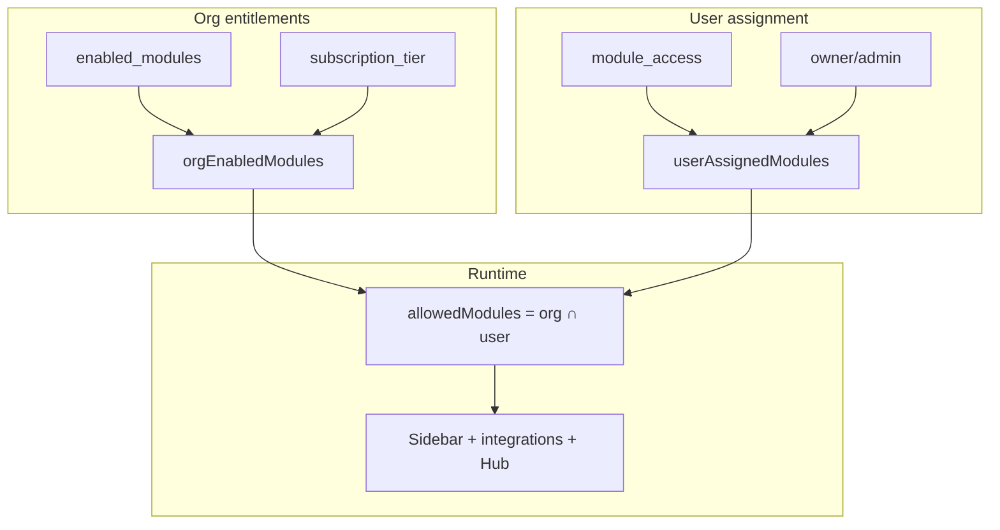
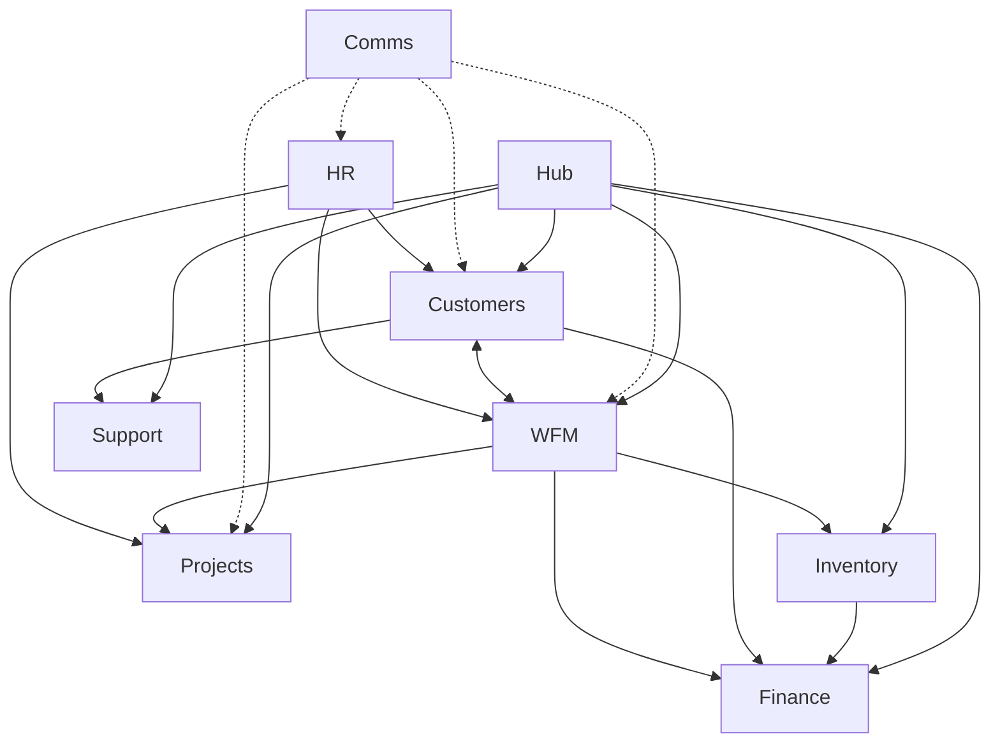

# Katana Platform — Architecture & Module Connections

**Document version:** June 2026  
**Audience:** Internal team (product, engineering, sales, customer success)  
**Purpose:** How Katana modules connect, synchronize, and adapt to each client's plan.

---

## Executive summary

Katana is a **modular business platform** with **15 registered modules**. Clients can run the full enterprise stack or pick and choose modules. The system:

1. Knows **what modules the organization has** (org entitlements)
2. Knows **what each user can access** (HR module assignment)
3. **Automatically wires** cross-module connections only where both modules exist
4. **Aggregates everything** into the Hub as mission control

> **One line for leadership:** Add a module → connections appear. Remove a module → UI hides cleanly with no broken links.

---

## 1. Access control — three layers

Everything flows through a gating stack before any cross-module feature appears.

```
┌─────────────────────────────────────────────────────────────────┐
│  LAYER 1 — ORG ENTITLEMENTS (what the client purchased)         │
│                                                                 │
│  organizations.enabled_modules  (explicit pick-and-choose)      │
│  organizations.subscription_tier  (Free / Starter / Pro / Ent)  │
│  organizations.settings.enabled_modules  (fallback)             │
│                          ↓                                      │
│                   orgEnabledModules                             │
└─────────────────────────────────────────────────────────────────┘
                              ↓
┌─────────────────────────────────────────────────────────────────┐
│  LAYER 2 — USER ASSIGNMENT (what this person can use)           │
│                                                                 │
│  hr_employees.module_access  (per-employee checkboxes in HR)    │
│  owner / admin role  (gets all org modules)                     │
│                          ↓                                      │
│                   userAssignedModules                           │
└─────────────────────────────────────────────────────────────────┘
                              ↓
┌─────────────────────────────────────────────────────────────────┐
│  LAYER 3 — EFFECTIVE ACCESS (runtime)                           │
│                                                                 │
│  allowedModules = orgEnabledModules ∩ userAssignedModules       │
│                          ↓                                      │
│  Sidebar · Routes · Cross-module panels · Hub widgets           │
└─────────────────────────────────────────────────────────────────┘
```

**Rules:**

| Question | Answer |
|---|---|
| Does this integration exist for the org? | Both modules must be in `orgEnabledModules` |
| Can this user use the integration? | Both modules must be in `allowedModules` |
| Can HR assign a module to an employee? | Only modules in `orgEnabledModules` |

**Source files:** `src/lib/org-module-access.ts`, `src/contexts/ModuleAccessContext.tsx`

---

## 2. All 15 modules

| ID | Product name | Route |
|---|---|---|
| `hub` | Hub | `/hub` |
| `projects` | Katana PM | `/projects` |
| `inventory` | Katana Inventory | `/inventory` |
| `customer-success` | Katana Customers (CRM + KYC) | `/customer-success` |
| `workforce` | WFM | `/workforce` |
| `hr` | Katana HR | `/hr` |
| `employee` | Employee Portal | `/employee` |
| `careers` | Careers | `/careers` |
| `manufacturing` | Katana Facilities | `/manufacturing` |
| `automation` | Automation | `/automation` |
| `kyi` | Know Your Investor | `/kyi` |
| `comms` | Katana Comms | `/comms` |
| `agents` | Agent Office | `/agents` |
| `support` | Katana Support | `/support` |
| `finance` | Katana Finance | `/finance` |

**Source file:** `src/lib/module-access.ts`

---

## 3. Plan tiers — default module bundles

| Tier | Modules included | Typical use case |
|---|---|---|
| **Free** | Hub, Customers, Employee Portal, Support | Core suite trial |
| **Starter** | Free + PM, HR, Careers | Small team getting started |
| **Professional** | Starter + WFM, Inventory, Comms, Finance, Automation | Full operations stack |
| **Enterprise** | All 15 modules | Full platform |
| **Custom** | `enabled_modules` array in database | Pick-and-choose à la carte |

**Core suite** (included on every plan): Hub, Customers, Employee Portal, Support.

**Source file:** `src/lib/module-bundles.ts`

---

## 4. Integration graph — how modules talk to each other

Connections only activate when **both modules** are in the org's entitlement list.

### 4.1 Visual map

```
                    ┌──────────┐
                    │    HR    │  ← Identity layer (people → all modules)
                    └────┬─────┘
         ┌───────────────┼───────────────┐
         ↓               ↓               ↓
    ┌─────────┐    ┌──────────┐   ┌───────────┐
    │Projects │    │Customers │   │ Workforce │
    └────┬────┘    └────┬─────┘   └─────┬─────┘
         │              │    ↕           │
         │         deal won /           │
         │         client link          │
         │              │    ↕           │
         └──────────────┼───────────────┘
                        │
              timesheets → invoices
              jobs → project tasks
              job parts → inventory
                        │
         ┌──────────────┼──────────────┐
         ↓              ↓              ↓
    ┌──────────┐  ┌──────────┐  ┌──────────┐
    │ Inventory│  │ Finance  │  │ Support  │
    └────┬─────┘  └────┬─────┘  └──────────┘
         │             │
         └──── PO / invoice bank matching ────┘

    Comms ──embedded discussions──→ Projects, Customers, WFM, HR

    Hub ──KPIs + activity feed──→ all enabled modules above
```

### 4.2 Connection reference table

| From | To | What syncs | Implementation |
|---|---|---|---|
| **Customers** | **WFM** | Client on work order; deal won → work order | `crm-workflows.ts`, `wfm-integrations.ts` |
| **WFM** | **Customers** | Approved timesheets → draft invoice | `createDraftInvoiceFromJob()` |
| **WFM** | **Projects** | `project_id`, `task_id` on jobs | `wfm-integrations.ts`, `PmProjectLinkedRecords` |
| **WFM** | **Inventory** | Job parts; checkout on completion | `wfm_job_parts`, `checkoutJobPartsOnCompletion()` |
| **WFM** | **Finance** | Billable time → receivables path | WFM panel + Finance matching |
| **Customers** | **Finance** | Invoices ↔ bank deposit matching | `finance-match-suggestions.ts` |
| **Inventory** | **Finance** | POs ↔ bank outflow matching | `finance-match-suggestions.ts` |
| **Customers** | **Support** | `client_id` on support tickets | `customer-linked-records.ts` |
| **HR** | **Projects** | Employee assignees on tasks | `notification-recipients.ts` |
| **HR** | **WFM** | Technician roster | `wfm-api.ts` |
| **HR** | **Customers** | CSM → auth user link | `notification-recipients.ts` |
| **Comms** | **Projects** | Task discussion threads | `ModuleDiscussion` component |
| **Comms** | **Customers** | Client discussion threads | `ModuleDiscussion` component |
| **Comms** | **WFM** | Job discussion threads | `ModuleDiscussion` component |
| **Comms** | **HR** | Employee discussion threads | `ModuleDiscussion` component |
| **Hub** | **All enabled** | KPIs, activity feed, quick search/create | `hub-metrics.ts`, `hub-activity.ts` |

**Source file:** `src/lib/module-integrations.ts`

---

## 5. Hub — the synchronization layer

Hub does not own data. It **aggregates** from every module the org has enabled, then **filters** what each user can see.

```
  ┌─────────────┐  ┌─────────────┐  ┌─────────────┐  ┌─────────────┐
  │  Projects   │  │  Customers  │  │     HR      │  │     WFM     │
  │    API      │  │    API      │  │    API      │  │    API      │
  └──────┬──────┘  └──────┬──────┘  └──────┬──────┘  └──────┬──────┘
         │                 │                 │                 │
  ┌─────────────┐  ┌─────────────┐  ┌─────────────┐  ┌─────────────┐
  │  Inventory  │  │   Finance   │  │   Support   │  │     KYI     │
  │    API      │  │    API      │  │    API      │  │    API      │
  └──────┬──────┘  └──────┬──────┘  └──────┬──────┘  └──────┬──────┘
         │                 │                 │                 │
         └─────────────────┴────────┬────────┴─────────────────┘
                                    ↓
                    ┌───────────────────────────────┐
                    │  buildIntegrationPlan()       │
                    │  (which modules to pull)      │
                    └───────────────┬───────────────┘
                                    ↓
              ┌─────────────────────┴─────────────────────┐
              ↓                     ↓                     ↓
     ┌─────────────────┐  ┌─────────────────┐  ┌─────────────────┐
     │  KPI cards      │  │  Activity feed  │  │  Module cards   │
     │  hub-metrics    │  │  hub-activity   │  │  + quick create │
     └─────────────────┘  └─────────────────┘  └─────────────────┘
                                    ↓
                    Filtered by user's allowedModules
```

**Hub aggregates from:** Projects, Customers, HR, Careers, Inventory, WFM, Support, KYI, Finance, Facilities, Automation.

**Source files:** `src/pages/HubPage.tsx`, `src/lib/hub-metrics.ts`, `src/lib/hub-activity.ts`

---

## 6. Shared platform services (glue)

These run across modules and are not separate sidebar items:

| Service | Role | Key file |
|---|---|---|
| **HR identity** | Maps employees → auth users for assignments & notifications | `notification-recipients.ts` |
| **Notifications** | Event bus per module (PM, HR, CS, WFM, Finance, etc.) | `notification-modules.ts` |
| **Comms context links** | Messages linked to client / project / task / job / employee | `comms-api.ts`, `ModuleDiscussion.tsx` |
| **Storage** | File buckets per module (projects, hr, inventory, wfm, customers) | `storage-api.ts` |
| **Agent Office / Automation** | AI chat via Agent Office; Automation = knowledge + tools | `ksync-context.ts`, Agent Office, `/automation` |

---

## 7. Example scenarios

### Scenario A — Client has Customers + WFM only

- Deal won in CRM → creates work order in WFM ✓
- Timesheet on job → draft invoice in Customers Commerce ✓
- Finance bank matching links → hidden (no Finance module)
- Inventory parts on jobs → hidden (no Inventory module)
- Hub shows Customers + WFM KPIs only

### Scenario B — Professional plan (no KYI, Agents, Facilities)

- Full CS ↔ WFM ↔ PM ↔ Inventory ↔ Finance ↔ Comms stack ✓
- Hub shows all professional-tier KPIs ✓
- KYI, Agents, Facilities not in sidebar

### Scenario C — Enterprise

- All 15 modules, all integrations active
- Hub = full mission control

### Scenario D — User has WFM but not Customers

- Can see their jobs
- Client name visible on job (read-only)
- Cannot open Customers tab or create invoices (no CS access)
- Manager with both modules sees full link

---

## 8. Where to view this in the app

| Location | What it shows |
|---|---|
| **Settings → Organization** | "Modules & connections" card — enabled modules, active integrations, unlock hints |
| **Hub** | Live KPIs and activity from connected modules |
| **Customer detail** | Linked WFM jobs, invoices, support tickets |
| **Project detail** | Linked WFM jobs |
| **WFM job panel** | Cross-module links (invoice, project, parts) |
| **HR → Employee profile** | Module access assignment (clamped to org entitlements) |

---

## 9. Database & configuration

| Item | Table / column | Purpose |
|---|---|---|
| Org module list | `organizations.enabled_modules` | Explicit pick-and-choose entitlements |
| Plan tier | `organizations.subscription_tier` | Default bundle when `enabled_modules` is null |
| User modules | `hr_employees.module_access` | Per-user sidebar access |
| Comms links | `comms_context_links` | Discussion context types: task, client, employee, project, job, invoice |

**Migrations to run in Supabase:**

- `supabase-org-modules-migration.sql` — org entitlements column
- `supabase-comms-context-expansion-migration.sql` — job + invoice comms contexts
- `supabase-finance-notifications-migration.sql` — finance notification source
- `supabase-localhost-owner-full-modules.sql` — restore full access for dev owners

---

## 10. Engineering reference — key source files

| Concern | Path |
|---|---|
| Module registry | `src/lib/module-access.ts` |
| Tier bundles | `src/lib/module-bundles.ts` |
| Org entitlements resolver | `src/lib/org-module-access.ts` |
| Integration graph | `src/lib/module-integrations.ts` |
| User access context | `src/contexts/ModuleAccessContext.tsx` |
| Integration hook | `src/hooks/use-module-integration.ts` |
| WFM cross-links | `src/lib/wfm-integrations.ts` |
| CRM workflows | `src/lib/crm-workflows.ts` |
| Finance matching | `src/lib/finance-match-suggestions.ts` |
| Customer linked records | `src/lib/customer-linked-records.ts` |
| Hub metrics | `src/lib/hub-metrics.ts` |
| Hub activity | `src/lib/hub-activity.ts` |
| Org settings UI | `src/components/settings/OrgModulesIntegrationCard.tsx` |

---

## 11. Mermaid diagrams (for presentations)

Paste any block below into [https://mermaid.live](https://mermaid.live) to export as PNG/SVG for PowerPoint or Word.

### Access control flow



### Module integration graph



---

*Katana vv2 — Internal architecture document. Update when new modules or integration edges are added to `module-integrations.ts`.*
