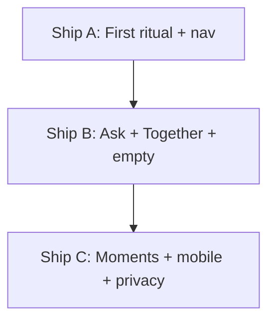

# UX intuition polish — build plan (points 1–10)

Make the first 60 seconds and the daily loop feel inevitable. No new modules, no LLM.

## Ships

| Ship | Points | Status |
|------|--------|--------|
| **A** | 1, 2, 5, 7 | Done — ritual, slim More nav, teaching empty, hero focus |
| **B** | 3, 4 | Done — short Ask + follow-up chips; one-tap Add-me |
| **C** | 6, 8, 9, 10 | Done — capture celebrate, day-closed moment, mobile sheet/targets, privacy UX |

## Point map

1. **Guided first ritual** — welcome → capture → Do this next → optional invite (`FirstRitual`)
2. **Slim nav** — Today / Ask / Friends primary; Plan / Life / Shared / Circles under More
3. **Ask sharp** — short replies, 3 suggested asks, “What’s next?” after actions
4. **One-tap invite** — `InviteFriendButton` + share/copy; mobile bottom sheet with QR
5. **Teaching empty** — example capture / Load demo day on empty Do this next
6. **Capture confidence** — preview like `Task · Call Mom · Fri 3pm`; first-capture confetti
7. **Hero focus** — hide empty Coming up / Goals; Also today collapsed
8. **Evening close moment** — full-bleed `DayClosedMoment` before PWA nudge
9. **Mobile feel** — safe-area, min 44px targets, invite drawer on narrow screens
10. **Privacy UX** — Today line + connect toast + Settings “Together (optional)” copy

## Out of scope

Capacitor/store, RevenueCat, LLM, new modules, Documents/Notes depth, Circles feature expansion.
